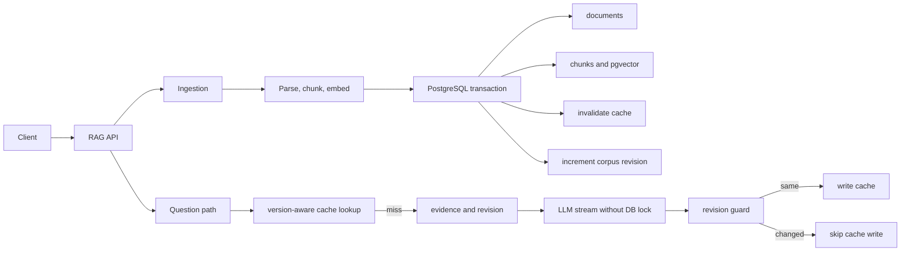

# Versioned RAG Backend Case Study

문서와 검색 설정이 바뀐 뒤 이전 답변이 다시 사용되는 문제를 다룬 백엔드 사례 연구입니다. DB에 영속화되는 document, vector, cache 상태를 PostgreSQL과 pgvector transaction 경계로 모은 과정과 후속 검토에서 찾은 잔여 경쟁 조건을 함께 기록합니다.

> 정해진 요구사항과 기간 안에서 수행한 개인 프로젝트를 공개 가능한 범위로 재구성했습니다. 이 저장소는 실행 가능한 구현체가 아니라 설계와 검증 문서입니다. 원본 요구사항, 전체 구현 코드, 비공개 저장소 이력은 포함하지 않습니다.

## 3분 요약

| 질문 | 답변 |
|---|---|
| 어떤 문제인가 | 문서나 prompt, embedding, retrieval 정책이 바뀐 뒤에도 이전 답변이 유효한 cache처럼 재사용될 수 있는 문제입니다. |
| 처음에는 무엇이 잘못됐나 | metadata와 cache는 SQLite, vector는 별도 저장소에 있어 한쪽 성공과 다른 쪽 실패를 하나의 commit과 rollback으로 설명할 수 없었습니다. |
| 첫 수정은 무엇인가 | 실패 전에 관련 cache를 무효화하고, 실패 후 재시도와 동일 hash 재업로드 경로를 회귀 테스트로 고정했습니다. |
| 왜 다시 설계했나 | 호출 순서를 고쳐도 두 저장소의 commit은 원자적이지 않았습니다. 보상 로직을 늘리는 대신 DB에 저장되는 상태를 PostgreSQL과 pgvector로 합쳤습니다. |
| 제출본의 마지막 구조는 무엇인가 | document, chunk, 저장된 vector, cache invalidation, corpus revision 변경을 한 DB transaction에 묶었습니다. |
| 늦은 LLM 응답은 어떻게 다루나 | 제출본은 retrieval 당시 revision과 cache write 당시 revision이 다르면 저장을 생략합니다. 다만 후속 검토에서 ingestion의 invalidation 이후 revision update 전에 cache writer가 끼어들 수 있는 잔여 경쟁 조건을 찾았습니다. 제출본이 모든 late write를 차단한다고 주장하지 않습니다. |
| 본인의 역할은 무엇인가 | 개인 프로젝트로 요구사항 해석, 대안 선택, 실패 조건과 수용 기준 정의, 결과 판정을 책임졌습니다. Codex는 코드와 테스트 초안을 만드는 구현 도구로 사용했습니다. |
| 무엇을 입증하지 않았나 | 프로덕션 운영, 대규모 트래픽, 성능 우위, 고가용성, single-flight, 답변 전체의 의미적 정확성은 입증하지 않았습니다. |

## 증거 경계

| 항목 | 현재 공개 상태 |
|---|---|
| 문제 정의, 설계 선택, 트레이드오프와 한계 | 이 저장소에서 공개 검토 가능 |
| 구현 변경과 회귀 테스트 통과 | 비공개 제출 원본의 고정 커밋과 CI에서 확인, 이 저장소만으로 독립 재실행 불가 |
| 최초 실패를 실행한 red 로그 | 보존된 자료에서 확인하지 못함 |
| 후속 lock-order 반례 | 공개 문서와 비공개 제출 코드의 transaction 순서를 대조해 확인, 수정과 회귀 테스트는 아직 완료하지 않음 |
| 실제 모델 공급자 호출 | 이 사례의 최종 검증 범위에 포함되지 않음 |
| 프로덕션 준비도와 운영 성과 | 검증하지 않음 |

테스트 이름은 어떤 불변식을 다뤘는지 보여주는 보조 증거입니다. 테스트 수나 문서의 상세함만으로 구현 품질과 운영 준비도를 주장하지 않습니다.

## 문제를 상태 전이로 보기

질문 문자열이 같아도 유효한 답은 문서 상태와 검색 정책에 따라 달라집니다. 다음 순서가 가능해요.

1. 질문 A가 corpus revision 10에서 근거를 검색합니다.
2. 문서가 갱신되어 revision 11이 됩니다.
3. 질문 A의 느린 LLM 응답이 끝납니다.
4. revision 10의 답변이 현재 cache처럼 저장됩니다.

문서 갱신 시 cache를 지우는 것만으로는 4번을 막지 못합니다. 변경 전에 검색을 끝낸 요청이 변경 후 cache를 다시 쓸 수 있기 때문입니다.

## 실제 cache 정합성 계약

이 사례는 cache lookup, invalidation, late write guard를 서로 다른 책임으로 구분합니다.

| 경계 | 사용하는 상태 | 책임 |
|---|---|---|
| Cache lookup | normalized question 또는 embedding similarity, prompt version, embedding version, retrieval version, active 상태 | 현재 설정과 호환되는 활성 entry만 조회 |
| Invalidation | document dependency, 새 chunk와 cached question의 similarity, chunking과 indexing 설정 변경 | 제출본 정책에서 영향 대상으로 판정한 entry를 비활성화 |
| Late write guard | retrieval 시점의 expected corpus revision과 write 시점의 current revision | Revision 변경이 먼저 가시화된 경우 stale cache write를 생략. Invalidation 이후 revision lock 전 interleaving은 제출본에 남음 |

Global corpus revision은 현재 cache lookup key에 직접 포함되지 않습니다. Document dependency도 cache identity가 아니라 invalidation 대상을 찾는 관계입니다.

제출본의 invalidation 정책은 다음과 같습니다.

- 새 document, chunking version 변경, indexing version 변경은 모든 active cache를 비활성화합니다.
- 기존 document update는 해당 document dependency가 있는 cache를 비활성화합니다.
- 기존 dependency가 없어도 새 version의 chunk와 cached question embedding의 cosine similarity가 retrieval threshold 이상이면 비활성화합니다.

Similar cache hit도 설정된 similarity threshold를 사용하며, threshold 변경은 retrieval version을 바꿉니다. 이 정책은 제출본의 검색 경계와 cache 경계를 맞추기 위한 규칙이지, 모든 의미 변화와 오탐을 제거했다는 품질 보장은 아닙니다.

## 제출본의 마지막 구조

### Retrieval snapshot

Retrieval transaction은 corpus revision row를 shared lock으로 읽은 뒤 ready chunk를 검색합니다. Ingestion이 revision을 갱신하고 commit하는 경계가 retrieval 중간에 끼어들지 않도록 하기 위한 선택입니다.

### Cache write guard

Cache write transaction은 corpus revision row를 update lock으로 읽고 expected revision을 비교합니다. Revision이 같을 때만 같은 transaction에서 cache를 저장해, 비교와 insert 사이의 변경을 막습니다.

### 문서 갱신 동시성

같은 document identity는 transaction advisory lock으로 직렬화합니다. 서로 다른 문서에는 전역 advisory lock을 사용하지 않지만, global revision 증가는 `corpus_state` row update 구간에서 짧게 직렬화됩니다.

Parsing과 embedding 생성은 DB transaction 밖에서 수행됩니다. 따라서 advisory lock은 commit 순서를 만들지만 요청 도착 순서를 보장하지 않습니다. 최신 요청 우선, multi-document atomic update, 분산 lock은 이 사례의 보장 범위가 아닙니다.

### 사용자에게 보이는 답변

현재 구현은 retrieval snapshot을 기준으로 생성한 delta를 사용자에게 스트리밍합니다. 이미 전송한 답변은 회수하지 않아요. Cache writer가 변경된 revision을 관찰하면 저장을 생략하지만, 아래 lock-order gap에서는 이전 revision을 관찰할 수 있습니다.

### 후속 검토에서 찾은 lock-order gap

제출본의 ingestion transaction은 새 document와 vector 저장, cache invalidation, ready version 전환 뒤에 `corpus_state` revision을 갱신합니다. Cache writer는 revision row를 잠근 뒤 expected revision을 비교하고 새 cache row를 저장해요.

이 순서에는 다음 interleaving이 남습니다.

1. Ingestion이 기존 active cache를 무효화하지만 아직 revision row를 잠그지 않습니다.
2. 이전 revision에서 시작한 cache writer가 revision row를 먼저 잠급니다.
3. Writer는 아직 이전 revision을 읽고 새 active cache row를 저장한 뒤 commit합니다.
4. Ingestion은 이미 invalidation 단계를 지났으므로 새 row를 다시 무효화하지 않습니다.
5. Ingestion이 revision을 증가시키고 commit하면 이전 근거의 cache가 active로 남을 수 있습니다.

따라서 기존 revision guard는 순차적으로 revision 변경이 끝난 뒤 도착한 write는 거절하지만, 위 overlap까지 닫았다고 볼 수 없습니다. 가장 직접적인 보정안은 ingestion이 cache invalidation 전에 revision row를 update lock으로 획득하고 commit까지 유지하는 것입니다. 이 보정안과 barrier 기반 회귀 테스트는 아직 구현하거나 검증하지 않았습니다.

## 비공개 원본에서 다룬 회귀 조건

- document, chunk, vector, revision이 함께 commit되거나 rollback되는가
- 같은 문서의 동일 내용 동시 요청이 하나의 ready version과 revision으로 정리되는가
- 서로 다른 문서의 동시 commit이 revision 증가를 잃지 않는가
- prompt, embedding, retrieval version 불일치 시 기존 cache를 재사용하지 않는가
- ingestion commit으로 revision 변경이 끝난 뒤 stale cache write를 시도하면 생략하는가
- cache invalidation 뒤 transaction이 실패하면 이전 ready corpus와 cache 상태가 복원되는가
- 같은 bytes라도 indexing policy가 달라지면 새 document version으로 재색인하는가
- evidence가 없으면 LLM 호출과 cache 저장을 생략하는가

테스트 이름과 실패 과정은 [실패에서 수정까지](docs/FAILURE_TO_FIX.md)에 정리했습니다.

## 현재 한계

- 이 공개본에는 실행 가능한 전체 코드와 test output이 없습니다.
- Ingestion invalidation과 revision update 사이에 cache writer가 끼어드는 경쟁 조건은 후속 검토에서 발견했으며, 수정과 barrier 기반 회귀 테스트는 아직 완료하지 않았습니다.
- Embedding version 변경 시 전체 corpus를 재색인하고 새 version을 원자적으로 활성화하는 배포 절차는 이 사례에서 입증하지 않았습니다.
- Cache hit 직후 corpus가 변경될 수 있으며, 현재 계약은 cache lookup 시점을 유효성 판단 지점으로 봅니다.
- 단일 corpus 범위의 사례입니다. Tenant와 ACL별 cache isolation은 다루지 않습니다.
- 실제 모델 공급자, 운영 트래픽, latency, throughput, cost, HA 결과는 없습니다.
- Citation은 retrieval provenance를 나타내며 답변 모든 문장의 entailment를 보장하지 않습니다.

## 문서 지도

[전체 문서 안내](docs/README.md)에서 증거 상태와 권장 읽기 순서를 먼저 볼 수 있습니다.

1. [실패에서 수정까지](docs/FAILURE_TO_FIX.md): 최초 수정이 왜 충분하지 않았는지
2. [아키텍처와 일관성 계약](docs/ARCHITECTURE.md): transaction, lock, revision의 실제 경계
3. [설계 결정](docs/DECISIONS.md): 선택한 대안과 포기한 것
4. [AI 사용과 책임](docs/AI_USE_AND_RESPONSIBILITY.md): AI 도구와 사람의 판단 범위

공개 범위, 문제 신고와 이용 조건은 [보안 및 공개 경계](SECURITY.md)를 따릅니다.
