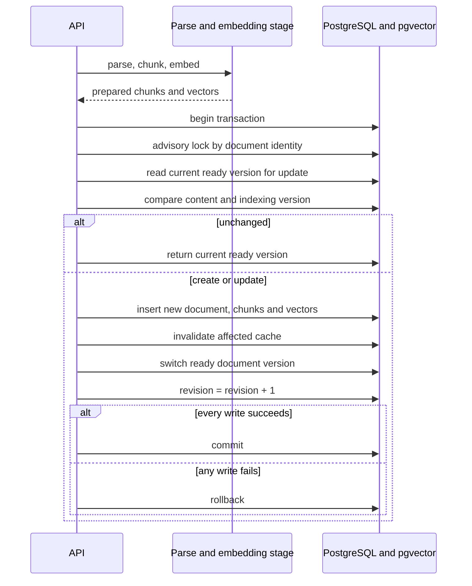
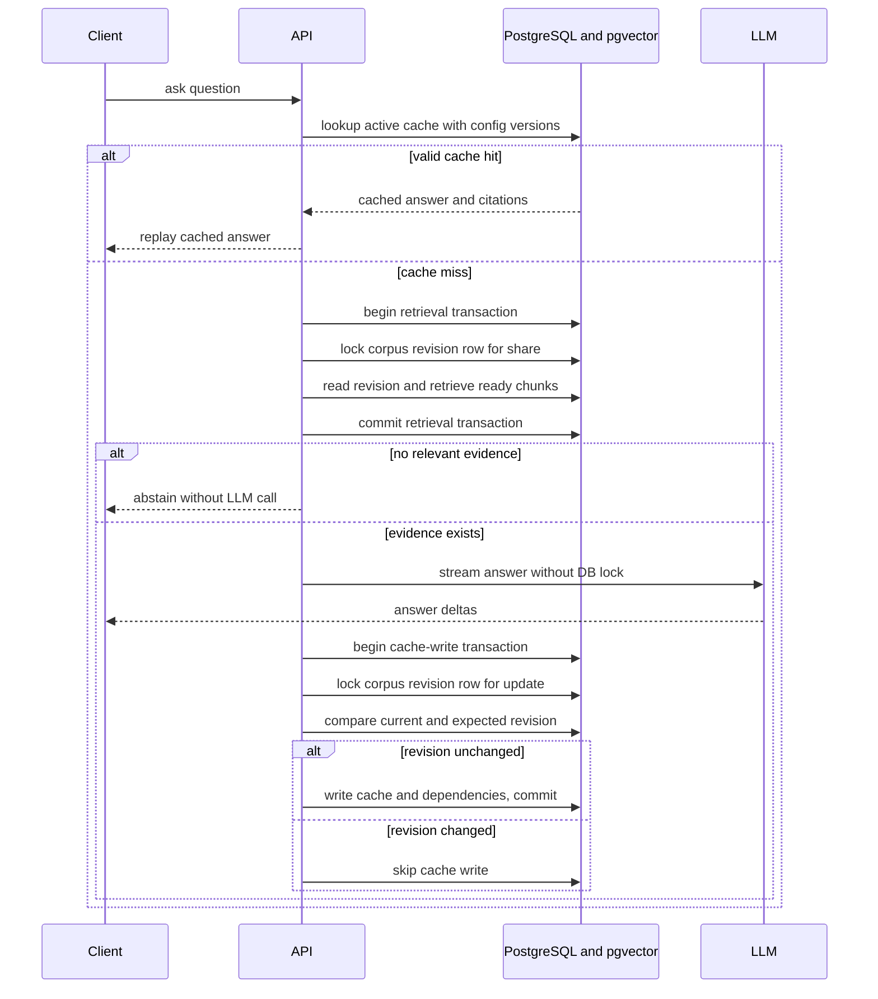

# 아키텍처와 일관성 계약

## 범위

이 문서는 단일 corpus에서 document create, update, reindex와 answer cache를 다룬 사례의 경계를 설명합니다.

다음은 범위 밖입니다.

- document delete와 multi-document atomic update
- tenant와 ACL별 corpus 및 cache isolation
- 분산 database와 multi-region consistency
- single-flight와 중복 LLM 생성 방지
- embedding model 변경 중 전체 corpus의 atomic cutover
- 프로덕션 트래픽, latency, throughput, cost와 HA

## 목표 불변식

1. DB에 저장되는 document, chunk, vector, cache invalidation, corpus revision 변경은 함께 commit되거나 rollback되어야 합니다.
2. 새 document와 설정 변경은 전체 cache를, 기존 document update는 dependency와 similarity 정책이 영향 대상으로 판정한 cache를 비활성화합니다.
3. 같은 document identity의 DB commit은 transaction advisory lock으로 직렬화합니다.
4. Cache 저장 전에 corpus revision 변경이 이미 가시화되면 이전 근거로 생성한 답변을 새 cache로 저장하지 않습니다.
5. Evidence가 없거나 prompt budget에 근거를 넣을 수 없으면 LLM 호출과 cache 저장을 생략합니다.

이 불변식은 항상 최신 답변 반환, 모든 mutation 지원, citation entailment를 의미하지 않습니다. Invalidation 이후 revision row lock 전에 새 cache writer가 끼어드는 overlap은 후속 검토에서 발견한 미해결 경계입니다.

## 상태와 책임

| 상태 | 저장 위치 | 역할 |
|---|---|---|
| document version과 ready 상태 | PostgreSQL | 현재 조회 가능한 문서 version 선택 |
| chunk와 저장된 embedding vector | PostgreSQL과 pgvector | retrieval 대상 |
| answer cache와 active 상태 | PostgreSQL | exact 또는 similar cache 조회 |
| cache dependency | PostgreSQL | 문서 변경 시 기존 근거 관계를 추적 |
| corpus revision | PostgreSQL singleton row | retrieval 시점과 late cache write 시점의 corpus 변경 감지 |
| parsing과 embedding 생성 | DB transaction 밖 | DB write 전에 저장 후보를 준비 |

## Ingestion

### Transaction 경계

Parsing과 embedding 생성은 transaction 전에 끝냅니다. 외부 연산 동안 DB transaction과 lock을 유지하지 않기 위한 선택이에요.

Lock을 획득한 뒤 current ready document의 content hash와 indexing version을 다시 확인합니다. 같은 상태라면 no-op으로 끝내고, 다르면 새 version을 저장합니다.

이 구조는 DB commit을 직렬화하지만 요청 도착 순서를 보장하지 않습니다. 두 요청의 embedding 준비 시간이 다르면 나중에 lock을 얻은 요청이 최종 version이 될 수 있어요. 최신 요청 우선이 필요하다면 expected document version 또는 별도 generation 계약이 추가로 필요하지만, 이 사례에서는 구현과 검증을 주장하지 않습니다.

### Ingestion 실패 의미

제출본의 마지막 구조에서 parsing 또는 embedding 실패는 DB write 전에 종료됩니다. DB transaction이 시작된 뒤 document, chunk, vector, invalidation 또는 revision update가 실패하면 transaction 전체를 rollback합니다.

Rollback 뒤에는 마지막으로 성공한 ready corpus가 authoritative state로 남습니다. 따라서 같은 transaction에서 수행된 invalidation도 되돌아가고, 그 ready corpus에 맞던 기존 cache 상태를 유지할 수 있어요.

### 후속 검토에서 확인한 lock 순서의 빈틈

제출본은 cache invalidation과 ready version 전환 뒤에 `corpus_state` row를 갱신합니다. Cache writer는 같은 row를 update lock으로 읽은 뒤 revision을 비교하고 cache를 insert해요.

이때 ingestion이 invalidation을 끝냈지만 revision row를 아직 잠그지 않은 순간, 이전 retrieval의 cache writer가 revision row를 먼저 잠글 수 있습니다. Writer는 이전 revision을 보고 새 active cache를 저장하고, 그 뒤 ingestion이 revision을 증가시킬 수 있어요. Ingestion의 invalidation statement는 이미 끝났으므로 새 row는 active 상태로 남을 수 있습니다.

따라서 현재 제출본의 lock 순서는 모든 late cache write를 차단하지 않습니다. Ingestion이 document advisory lock을 얻은 직후, cache invalidation보다 먼저 revision row를 update lock으로 획득하고 commit까지 유지하는 방안이 직접적인 보정 후보입니다. 다음 조건을 barrier로 고정한 회귀 테스트도 필요합니다.

1. Ingestion이 revision row를 잠근 뒤 invalidation 전 또는 직후에 정지
2. 이전 revision의 cache writer가 저장을 시도
3. Writer가 ingestion commit까지 진행하지 못함을 확인
4. Ingestion commit 뒤 writer가 revision mismatch로 저장을 생략하는지 확인

이 보정안과 회귀 테스트는 아직 구현하거나 검증하지 않았습니다.

## Question과 cache

### Retrieval과 revision의 일관성

Retrieval transaction은 corpus revision row를 shared lock으로 먼저 읽습니다. Ingestion의 global revision update는 이 row와 충돌하므로, document commit이 retrieval의 revision read와 chunk read 사이에 완료되는 것을 막습니다.

이 방식은 단순히 두 값을 별도 `READ COMMITTED` statement로 읽는 것과 다릅니다. 공개본은 실제 SQL 전체를 제공하지 않지만, 이 lock 순서를 consistency contract로 명시합니다.

### Cache write guard의 원자성

Cache write transaction은 revision row를 update lock으로 읽습니다. Current revision이 expected revision과 같을 때만 같은 transaction에서 cache와 dependency를 저장합니다.

Revision 비교와 cache insert가 같은 lock과 transaction 안에 있으므로, ingestion의 revision update가 이미 같은 row lock을 기다리거나 보유한 경우에는 그 사이에 끼어들지 않습니다.

다만 ingestion은 invalidation 뒤에 revision row를 갱신합니다. Invalidation 이후 cache writer가 row lock을 먼저 얻는 interleaving은 이 guard만으로 닫히지 않으며, 위의 lock 순서 보정이 필요합니다.

### 사용자 응답의 의미

LLM delta는 cache write guard보다 먼저 사용자에게 전달됩니다. 생성 중 corpus revision이 달라져도 이미 전송한 답변을 회수하지 않아요.

따라서 현재 계약은 다음과 같습니다.

- 사용자 응답: retrieval snapshot 기준 답변을 반환할 수 있음
- cache persistence: cache writer가 변경된 revision을 관찰하면 저장하지 않음. Invalidation 이후 revision lock 전 overlap은 예외
- 보장하지 않는 것: 응답 완료 시점의 최신 corpus 기준 답변

### Cache hit의 판단 시점

Cache lookup은 active 상태와 prompt, embedding, retrieval version을 확인합니다. Global corpus revision을 cache lookup key와 직접 비교하지 않습니다.

Cache row를 읽은 직후 corpus가 변경될 수 있으므로, 현재 계약은 활성 cache row를 읽은 시점을 유효성 판단 지점으로 봅니다. 더 강한 latest-at-return consistency는 이 사례의 범위가 아닙니다.

## Cache의 세 가지 경계

| 경계 | 조건 | 변경 시 처리 |
|---|---|---|
| Lookup identity | normalized question 또는 embedding similarity, prompt version, embedding version, retrieval version, active | 불일치 entry는 hit로 사용하지 않음 |
| Invalidation | dependency, 새 document, 새로 관련될 수 있는 chunk, chunking과 indexing 변경 | 영향받을 수 있는 active entry를 비활성화 |
| Late write guard | expected corpus revision과 current corpus revision | 불일치 시 cache write 생략 |

TTL은 오래된 entry 정리에 사용할 수 있지만 변경 직후의 의미적 유효성을 보장하지 않습니다.

제출본의 invalidation 범위는 다음과 같습니다.

- 새 document, chunking version 변경, indexing version 변경은 모든 active cache를 비활성화합니다.
- 기존 document update는 해당 document dependency가 있는 cache를 비활성화합니다.
- 기존 dependency가 없어도 새 document version의 chunk와 cached question embedding의 cosine similarity가 retrieval threshold 이상이면 비활성화합니다.

마지막 규칙은 제출본의 검색 정책과 같은 threshold를 사용하는 구현 정책입니다. 근사 similarity가 모든 미래 의미 변화를 수학적으로 포괄한다는 주장은 아니에요.

## Version 계약

| Version | 대표하는 변화 |
|---|---|
| prompt version | prompt template과 evidence packing 정책 |
| embedding version | query와 document vector 공간 |
| retrieval version | top-k, relevance threshold, filter와 ranking 정책 |
| chunking version | document 분할 정책 |
| indexing version | chunking version과 embedding version의 결합 |

같은 bytes의 document라도 indexing version이 다르면 새 document version으로 재색인하고 관련 cache를 무효화합니다.

다만 이 사례는 embedding version 배포 시 기존 모든 document를 먼저 재색인하고 새 query embedding version을 원자적으로 활성화하는 전체 corpus cutover를 입증하지 않습니다. 이 절차 없이 query와 stored vector의 embedding 공간이 섞이지 않는다고 주장하지 않아요.

## 동시성 경계

| 경쟁 | 사용하는 경계 | 현재 의미 |
|---|---|---|
| 같은 document의 두 commit | document identity advisory lock | DB commit 순서 직렬화, 요청 도착 순서는 보장하지 않음 |
| 서로 다른 document commit | document별 lock과 atomic revision row update | document write는 분리, global revision update 구간은 짧게 직렬화 |
| retrieval과 ingestion | revision row shared lock 대 update | evidence와 expected revision의 경계 유지 |
| cache write와 ingestion | revision row update lock | guard 비교와 cache insert 사이 변경 차단 |
| LLM generation과 ingestion | DB lock 없음 | stale answer 반환 가능. Revision 변경이 먼저 가시화되면 cache write를 생략하지만 lock-order overlap은 남음 |

## 검증하지 않은 것

- 모든 cache writer와 mutation 경로가 이 계약을 영구히 우회하지 않는다는 프로덕션 보장
- delete, bulk import, background worker와 관리자 경로
- advisory lock collision, timeout과 deadlock recovery의 운영 정책
- embedding version의 전체 corpus cutover
- tenant와 ACL isolation
- distributed lock과 multi-region consistency
- single-flight, 성능 우위와 HA
- citation의 claim-level entailment
- invalidation 이후 revision update 전에 cache writer가 끼어드는 경쟁 조건의 수정과 barrier 기반 회귀 테스트
